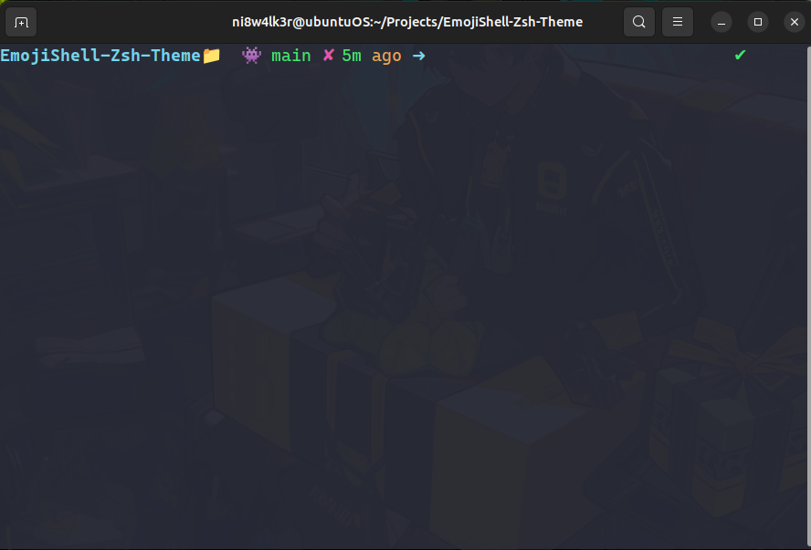

<h1 align="center">emojishell</h1>

## Description

The emojishell Oh-My-Zsh theme is a minimal and informative theme that provides visual indicators and information about your current directory, Git repository status, and the time since the last commit.

## Screenshots



## Prompt Overview

The prompt is designed to provide you with quick and useful information at a glance:

- **Current Directory**: Displayed at the start of the prompt, showing the name of your current directory.

- **Git Information**: Displayed after the current directory, indicating the Git repository status. It includes the Git branch name, and whether there are uncommitted changes or not.

- **Time Since Last Commit**: Displayed at the end of the prompt, showing the time elapsed since the last Git commit. If you're not in a Git repository, a "✭" character is displayed.

- **Exit Status Indicator**: In the right prompt (RPROMPT), it shows a green checkmark (✔) for a successful command execution and a red "X" (✘) for a failed command execution.

## Indicators and Their Meanings

### Current Directory Indicator

- **Folder Icon (📁)**: The folder icon emoji indicates your current directory.

### Git Information Indicators

- **Git Branch Indicator (👾)**: The "👾" emoji indicates that you are in a Git repository.

- **Git Clean Indicator (✔)**: A green checkmark (✔) indicates that the Git repository has no uncommitted changes. Your working directory is clean.

- **Git Dirty Indicator (✘)**: A red "X" (✘) indicates that the Git repository has uncommitted changes. Your working directory is dirty.

### Time Since Last Commit Indicator

- The "ago" text after the time duration indicates how long ago the last Git commit was made.

- If the last commit was made within the last 30 minutes, the time is displayed in green, indicating recent activity.

- If the last commit was made within the last 4 hours, the time is displayed in yellow, indicating somewhat recent activity.

- If the last commit was made more than 4 hours ago, the time is displayed in red, indicating that it's been a while since the last commit

## Installation
1. Clone the emojishell repo:
```bash
   git clone https://github.com/adarshswaminath/EmojiShell-Zsh-Theme  
   ```
2. Copy the emojishell theme to your Oh My Zsh themes directory:
```bash
cp ./EmojiShell-Zsh-Theme/emojishell.zsh-theme ~/.oh-my-zsh/themes/emojishell.zsh-theme
```
3. Open ~/.zshrc in a text editor, find the ZSH_THEME line, and set it to:
```bash
ZSH_THEME="emojishell"
```

## Customization

You can customize this theme by adjusting the colors, icons, and formatting to match your preferences. The code is designed to be easily customizable, so feel free to modify it to suit your needs.

Enjoy your colorful and informative Zsh prompt with the emojishell theme!
